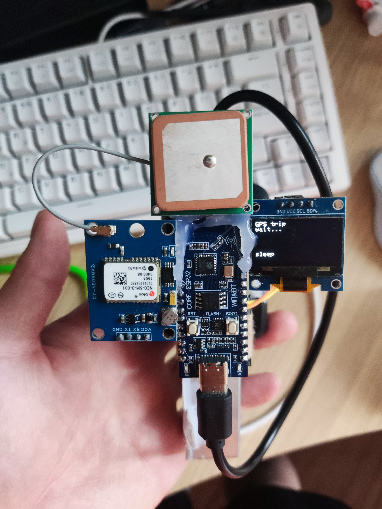
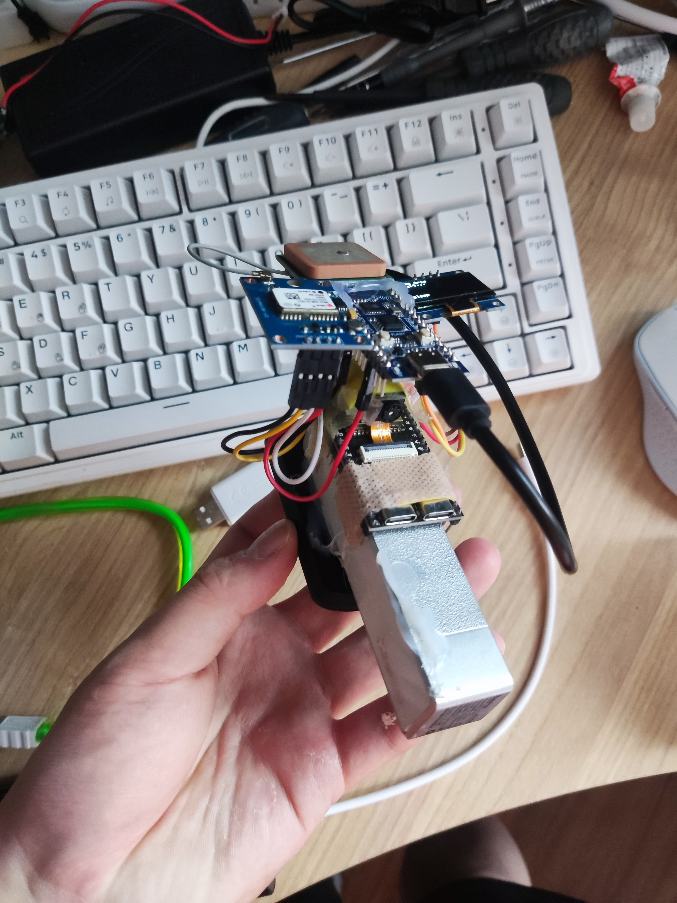
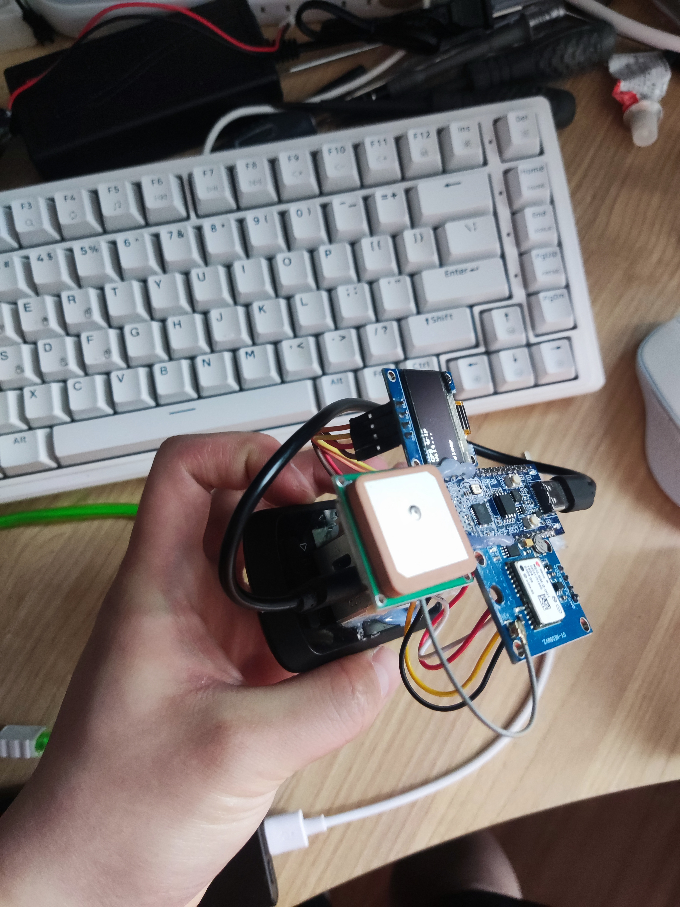
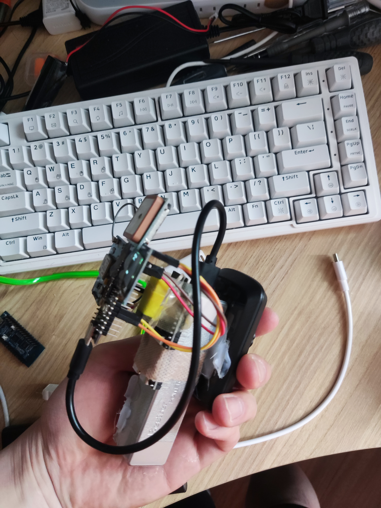
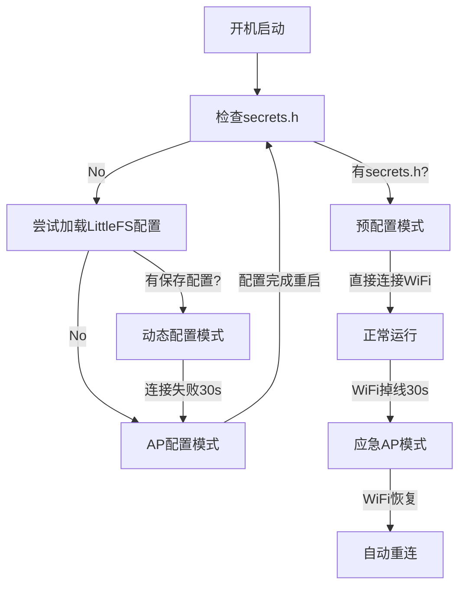

# ESP32-C3 GPS 码表项目

## 项目简介
本项目基于 ESP32-C3（如 airm2m_core_esp32c3）+ NEO-6M GPS 模块，实现了：
- 实时网页显示 GPS 数据和串口日志
- 码表功能（网页控制开始/结束，数据以 CSV 格式保存）
- LittleFS 持久化存储
- WiFi 配置（无 secrets.h 时自动进入 AP 模式，网页配置 WiFi）
- 支持 OLED（SSD1306）和 ST7735 两种屏幕，编译时可选
- AP 模式下支持 Captive Portal（DNS 劫持自动弹出 WiFi 配置页）
- 码表数据网页直接下载

## 实拍图片

项目硬件实物展示：


*ESP32-C3 + NEO-6M GPS 模块整体布局*


*GPS 模块和显示屏连接细节*


*完整硬件组装效果*


*系统运行状态展示*

## 主要功能
- 通过网页实时查看 GPS 信息、串口日志
- 网页可一键开始/结束码表，自动生成独立 CSV 文件
- LittleFS 存储 GPS 及码表数据，网页可直接下载
- 无 secrets.h 时自动进入 AP 模式，网页配置 WiFi
- 支持 OLED/彩屏，编译时通过 build_flags 选择
- AP 模式下 DNS 劫持，手机/电脑自动弹出配置页

## 使用说明
1. **硬件连接**
   - ESP32-C3（如 airm2m_core_esp32c3）
   - NEO-6M GPS 模块（默认 RX=0, TX=1）
   - 可选 OLED（SSD1306）或 ST7735 彩屏

2. **编译配置**
   - 使用 PlatformIO，推荐 VSCode 插件
   - `platformio.ini` 可通过 build_flags 选择屏幕类型：
     - `-D USE_OLED_SCREEN` 启用 OLED
     - `-D USE_ST7735_SCREEN` 启用 ST7735
   - 默认串口波特率 115200
   - `monitor_dtr = 0`、`monitor_rts = 0` 可避免打开串口时复位

3. **WiFi 配置**
   
   **方式一：预配置WiFi（推荐）**
   - 创建 `src/secrets.h` 文件，内容如下：
     ```cpp
     #define wifi_ssid "你的WiFi名称"
     #define wifi_password "你的WiFi密码"
     ```
   - 编译后自动连接指定WiFi，支持mDNS域名 `http://esp32gps.local/`
   
   **方式二：AP配置模式**
   - 无 `secrets.h` 时自动进入AP模式，热点名：`GPS-Config`（无密码）
   - **Captive Portal自动弹窗**：手机/电脑连接热点后自动弹出配置页
   - **手动访问**：http://192.168.4.1 进行WiFi配置
   - 配置完成后自动重启并连接WiFi
   - WiFi配置持久化保存到LittleFS
   
   **智能WiFi掉线处理**
   - WiFi连接失败或掉线30秒后，自动切换到AP模式：`GPS-AP-Data`
   - 在AP模式下仍可访问GPS数据和下载历史记录
   - WiFi恢复后自动重新连接

4. **网页功能**
   - 主页显示 GPS 实时数据、串口日志、码表控制按钮
   - 码表数据每秒自动记录，网页底部可直接下载所有历史 CSV 文件

5. **数据存储**
   - LittleFS 文件系统，GPS 日志和每次码表数据均独立保存
   - 码表数据标准 CSV 格式，便于后续分析

## WiFi功能详解

### **三种WiFi工作模式**

#### **1. 预配置模式（推荐生产使用）**
```cpp
// 创建 src/secrets.h 文件
#define wifi_ssid "你的WiFi名称"
#define wifi_password "你的WiFi密码"
```
- ✅ 开机自动连接WiFi，无需手动配置
- ✅ 支持mDNS域名访问：`http://esp32gps.local/`
- ✅ 网页配置功能被禁用，避免误操作

#### **2. AP配置模式（首次使用）**
当没有 `secrets.h` 文件时自动启用：
- 📶 **热点名**：`GPS-Config`（无密码）
- 🌐 **IP地址**：192.168.4.1
- 📱 **Captive Portal**：连接热点后自动弹出配置页面

**支持的设备自动弹窗路径**：
- Android: `/generate_204`
- Windows: `/fwlink`, `/ncsi.txt`
- iOS/macOS: `/hotspot-detect.html`

**配置步骤**：
1. 手机/电脑连接 `GPS-Config` 热点
2. 系统自动弹出配置页面（或手动访问 192.168.4.1）
3. 输入WiFi名称和密码
4. 点击"保存并连接"
5. 设备自动重启并连接WiFi

#### **3. 应急AP模式（智能故障切换）**
- ⚠️ **触发条件**：WiFi连接失败或掉线超过30秒
- 📶 **热点名**：`GPS-AP-Data`
- 🔄 **自动恢复**：WiFi信号恢复后自动重连

## 启动流程图



## 依赖库
- WiFi
- WebServer
- HTTPClient
- mikalhart/TinyGPSPlus
- LittleFS
- Adafruit SSD1306
- Adafruit GFX Library
- Adafruit ST7735 and ST7789 Library

## 目录结构
```
platformio.ini         # 项目配置
src/main.cpp          # 主程序
src/secrets.h         # （可选）WiFi 密码头文件
lib/                  # 可选库
```

## 常见问题

### **编译和调试**

- **串口监视器自动复位/下载**
  - 解决方案：在 `platformio.ini` 设置 `monitor_dtr = 0`、`monitor_rts = 0`

### **WiFi连接问题**

- **AP模式无法自动弹出配置页**
  - 检查手机/电脑DNS设置为"自动获取"
  - 手动访问：http://192.168.4.1
  - iOS用户：关闭"低数据模式"

- **配置WiFi后无法连接**
  - 检查WiFi名称和密码是否正确
  - 确认WiFi信号强度足够
  - 重启设备重新尝试连接

- **mDNS域名无法访问**
  - 确认设备与ESP32在同一局域网
  - Windows用户可能需要安装Bonjour服务
  - 备用方案：直接使用IP地址访问

- **WiFi频繁掉线**
  - 检查路由器信号强度
  - 系统会自动启动应急AP模式（30秒后）
  - 连接 `GPS-AP-Data` 热点继续使用

### **GPS相关**

- **GPS长时间无法定位**
  - 确保在室外开阔环境使用
  - 等待时间：冷启动通常需要1-5分钟
  - 检查GPS模块天线连接

- **网页显示"GPS数据超时"**
  - 检查GPS模块硬件连接（RX=0, TX=1）
  - 串口波特率确认为9600
  - 重启设备重新初始化GPS模块

